# Echando Raíces v2
Un proyecto de Fundación que Transforma.
Esta aplicación consiste el control y registro de áreas de forestación llevadas a cabo por la fundación.

## Tabla de Contenido
- [Información General](#información-general)
 - [Tecnologías](#tecnologías) 
 - [Estado del Proyecto](#estado-del-proyecto)
 - [Setup](#Setup)
	  * [Repositorio](#repositorio)
	  * [NodeJS Backend API](#nodejs-backend-api)
	  * [Users Route](#users-route)
	  * [Areas Route](#areas-route)
	  * [Forestation Route](#forestation-route)
- [Rubrica Características Conceptuales de la Herramienta](#rubrica-características-conceptuales-de-la-herramienta)
- [Tutorial de la Aplicación](#tutorial-de-la-aplicación)
	* [Registrarse](#registrarse)
	* [Iniciar Sesión](#iniciar-sesión)
	* [Menu](#menu)
	* [Inicio](#inicio)
	* [Perfil](#perfil) 
		+ [Perfil de Usuario](#perfil-de-usuario)
		+ [Cambiar Contraseña](#cambiar-contraseña)
	* [Espacios](#espacios)
		+ [Mis Espacios](#mis-espacios)
		+ [Agregar Espacio](#agregar-espacio)
	* [Forestaciones](#forestaciones)
		+ [Mis Forestaciones](#mis-forestaciones)
		+ [Agregar Forestación](#agregar-forestación)
	* [Acerca De](#acerca-de)
	* [Cerrar Sesión](#cerrar-sesión)
	  
## Información General
Echando Raíces es un programa de forestación organizado y dirigido por Fundación que Transforma. La cual lleva un registro de las forestaciones realizadas, donde se hicieron, quién es el encargado de la actividad, y el tipo y cantidad de árboles plantados, entre otros datos que relevancia para la fundación.
Para facilitar esta labor, los estudiantes de la materia de Aplicaciones Distribuidas, de la FCQI/UABC  desarrollaron una aplicación para dispositivos Android por medio de la cual se puede visualizar y llevar el control de esta información del programa.

## Tecnologías 
Al tratarse de un sistema dividido en BackEnd y FrontEnd, se utilizan varias tecnologías. De entre las usadas por el BackEnd tenemos el uso de MySQL para la base de datos, ejecutada por Express.js (JavaScript), así como algunos Middleware desarrollados por nosotros. Del lado del FrontEnd, la aplicación se desarrolló para dispositivos Android, por lo que está programada en Java y XML. A su vez, se hace uso de la API de Google Maps para el geoposicionamiento de las áreas de forestación almacenadas en la base datos.

## Estado del proyecto
El proyecto actualmente está terminado en cuanto al desarrollo, abierto a futuras mejoras o expansión, sin embargo, la aplicación del BackEnd requiere de un servidor para alojarse, ya que durante el desarrollo se utilizó un servidor para pruebas que expira próximamente.

## Setup
### Repositorio
git clone https://github.com/fqtransforma/UABC-2021.1-Flash.git

./Echando_Raices/

### NodeJS Backend API
./Echando_Raices_Api/

npm install

npm start (.env file required)

API @: 
http://ec2-54-227-98-150.compute-1.amazonaws.com:3600/

### Users Route
* Get all Users                     ->  _GET /users_
* Get specified User by ID          ->  _GET /users/:userId_
* Get areas linked to user          -> _GET /users/:userId/areas_
* Create new User                   -> _POST /users/signup_
* Login User                        -> _POST /users/login_
* Insert new User-Area Link         -> _POST /users/:userId/areas_
* Update specified User             -> _PATCH /users/:userId_
* Delete Specified User by ID       -> _DELETE /users/:userId_
* Get Specified User's forestations -> _GET /users/:userId/forestations_
* Update User's Forestation by ID   -> _UPDATE /users/:userId/forestations/:forestationId_

### Areas Route
* Get all Areas                     -> _GET /areas_
* Get specified Area by ID          -> _GET /areas/:areaId_
* Get all Area Types                -> _GET /areas/props/area-types_
* Get Area Type by ID               -> _GET /areas/props/area-types/:areaTypeId_
* Get All Addresses                 -> _GET /areas/props/addresses_
* Get Address by ID                 -> _GET /areas/props/addresses/:addressId_
* Get All Cities                    -> _GET /areas/props/cities_
* Get City by ID                    -> _GET /areas/props/cities/:cityId_
* Get All States                    -> _GET /areas/props/states_
* Get Cities in Specified State     -> _GET /areas/props/states/:stateId/cities_
* Post (Create) new Area            -> _POST /areas_
* Post new Area Type                -> _POST /areas/props/area-types_
* Post new Address                  -> _POST /areas/props/addresses_
* Update specified Area by ID       -> _PATCH /areas/:areaId_
* Delete Specified Area by ID       -> _DELETE /areas/:areaId_

### Forestation Route
* Get all Forestations              ->  _GET /forestations_
* Get specified Forestation by ID   ->  _GET /forestations/:forestationId_
* Get all Plant Types               ->  _GET /forestations/props/plant-types_
* Get specified plant type by ID    -> _GET /forestations/props/plant-types/:plantTypeId_
* Get Image data by ID              -> _GET /forestations/props/images/:imageId_
* Post (Create) new Forestation     -> _POST /forestations_
* Post new Plant Type               -> _POST /forestations/props/plant-types_
* Update Forestation by ID          -> _PATCH /forestations/:forestationId_
* Delete Forestation by ID          -> _DELETE /forestations/:areforestationId_

## Rubrica Características Conceptuales de la Herramienta
1. La herramienta refleja un análisis consistente con la lógica el problema propuesto e implementa un diseño orientado a sistemas distribuidos consistente con la lógica de la solución propuesta.
    * _El sistema es una solución al problema propuesto, implementando un diseño orientado a sistemas distribuidos, ya que es una solución de partes separadas trabajando junto, unas de estas partes siendo: rutas, controladores, middlewares, etc. El backend del servicio web API utiliza el modelo de arquitectura REST , que permite gran escalabilidad, de tal forma que puede servir a múltiples frontends en diferentes plataformas y dispositivos._

2. La herramienta adopta una arquitectura orientada a sistemas distribuidos y utiliza servicios en la nube para su implementación.
    * _La parte de backend de esta solución utiliza una arquitectura REST (orientada a sistemas distribuidos), utiliza servicios como base de datos, express.js y otros middlewares desarrollados por nosotros_

3. La herramienta considera un diseño de procesamiento balanceado consistente con la arquitectura adoptada
    * _Esta solución hace uso de ejecución de procesos asíncronos, con la intención de tener un flujo de ejecución continuó y un procesamiento balanceado. La arquitectura y tecnología utilizada permite la escalabilidad en poder de procesamiento y otros aspectos a través de "Load Balancers" con NGINX._

4. La herramienta implementa su propio protocolo de comunicación entre componentes dentro de un ambiente distribuido.
    * _Nuestra solución hace uso de distintos tipos de comunicación entre las partes del sistema, la comunicación entre la aplicación de Android (frontend) y el Web API (backend), se hace a través de llamadas HTTP con contenido exclusivamente de tipo JSON, para mantener consistencia a través de todas las plataformas a las que se sirve. Además la comunicación en la aplicación backend hace uso de módulos y middlewares con controladores para distintas tareas del sistema, por ejemplo, en la autenticación y autorización._

5. La herramienta considera estrategias de seguridad dentro de un ambiente distribuido.
    * _Esta solución y principalmente en el servicio web API (backend), hace uso de técnicas de autenticación y autorización a través de Json Web Tokens (JWT), el web API también incluye un sistema middleware de permisos que restringe accesos indebidos y permite accesos apropiados. Para datos críticos como contraseñas, se utilizan métodos de encriptación con sal (salting)._

## Tutorial de la aplicación
## Registrarse
Una vez instalada la aplicación en el dispositivo móvil, lo siguiente es registrarse en caso de no tener una cuenta. Para esto, se accede al formulario de registro mediante la opción en color rojo _Regístrate_ ubicada en la parte inferior de la aplicación. Esta acción mostrara el formulario de registro, en el cual solo se debe completar los campos correspondientes a correo electrónico, contraseña y la confirmación de esta. Una vez realizado lo anterior, se procede a pulsar el botón verde _REGISTRARSE_.

	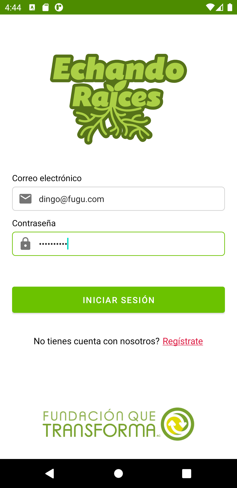
	

## Iniciar Sesión
Si ya se tiene una cuenta registrada en la aplicación, solamente se completan los campos correspondientes a correo electrónico y contraseña, después se pulsa el botón
verde _INICIAR SESIÓN_.

	

## Menu
La aplicación cuenta con un menu interactivo en el que se puede acceder a las opciones de _inicio, perfil, espacios, forestaciones, acerca de_ y _cerrar sesión_.

	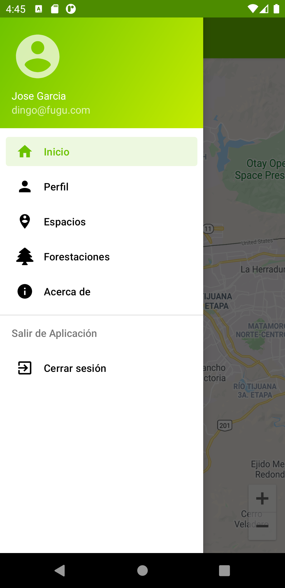

## Inicio
Una vez iniciada la sesión, se muestra el mapa en el cual se puede visualizar las forestaciones realizadas en la ciudad. 
_Nota: las forestaciones son representadas por el icono de una planta verde:_  

	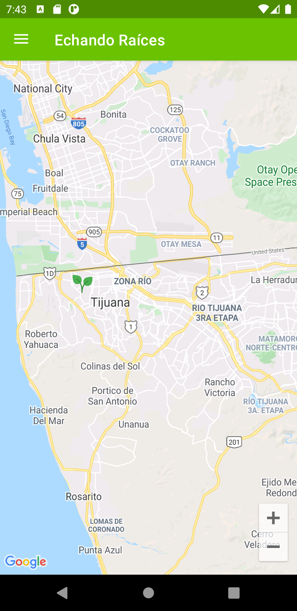

## Perfil
Opción para cambiar datos y contraseña del usuario.
### Perfil de Usuario
Aquí se puede cambiar los datos del usuario, tales como el _correo, nombre, apellido_ y _teléfono_. Para guardar los cambios se presiona el botón verde _ACTUALIZAR_.

	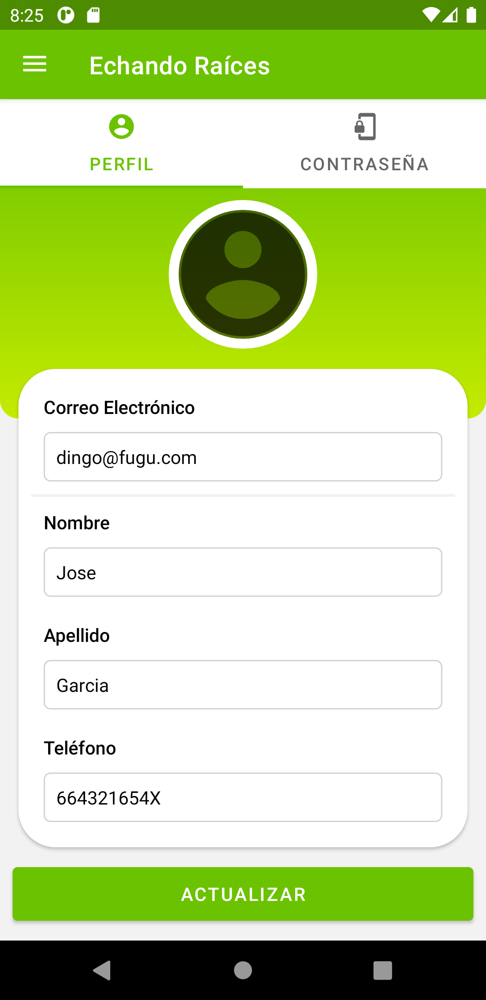

### Cambiar Contraseña
Aquí se puede cambiar la contraseña del usuario al completar los campos correspondientes. Para guardar los cambios se presiona el botón verde _ACTUALIZAR_.

	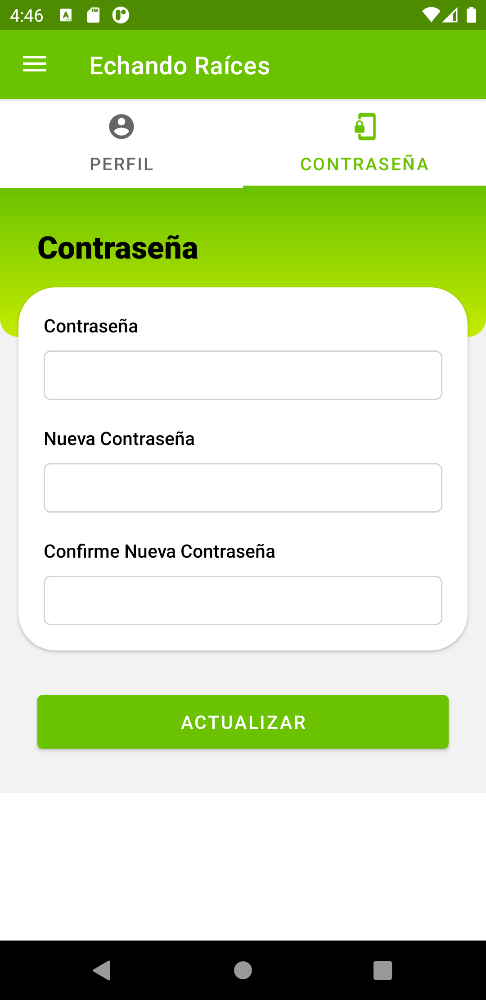

## Espacios
Opción para mostrar y agregar áeas o espacios a forestar.
### Mis Espacios
Aquí se muestra una lista de los espacios registrados por el usuario. Para ver los datos registrados del espacio solo se hace tap sobre el espacio deseado.

	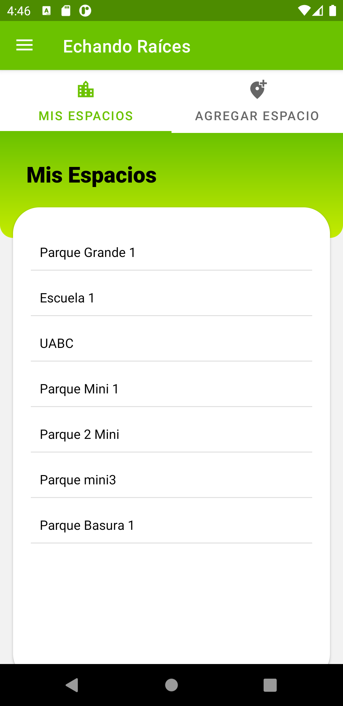
	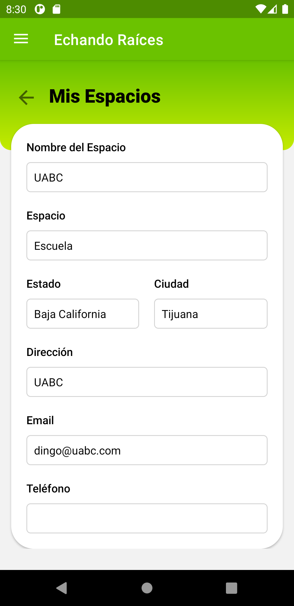

### Agregar Espacio
Aquí se pueden agregar las áreas o espacios a forestar. Para esto solo se deben llenar los campos correspondientes a _nombre del espacio, tipo de espacio, ciudad, direccioón, email_ y _teléfono_, seguido de presionar el botón verde _AGREGAR ESPACIO_.

	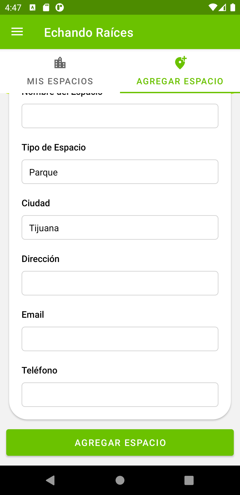

## Forestaciones
Opción para mostrar y agregar forestaciones.
### Mis Forestaciones
Aquí se muestran las forestaciones ya realizadas, las cuales tienen un _identificador, tipo de planta_ y _cantidad_. Para editar o agregar más detalles sobre la forestación, se hace tap sobre la forestación deseada, esto nos mostrara un panel en el cual se observa el _encargado, espacio, cantidad, tipo de planta_ y la ubicación en el mapa, de igual manera, se puede agregar un foto de la planta o árbol con el boton verde _FOTO_.

	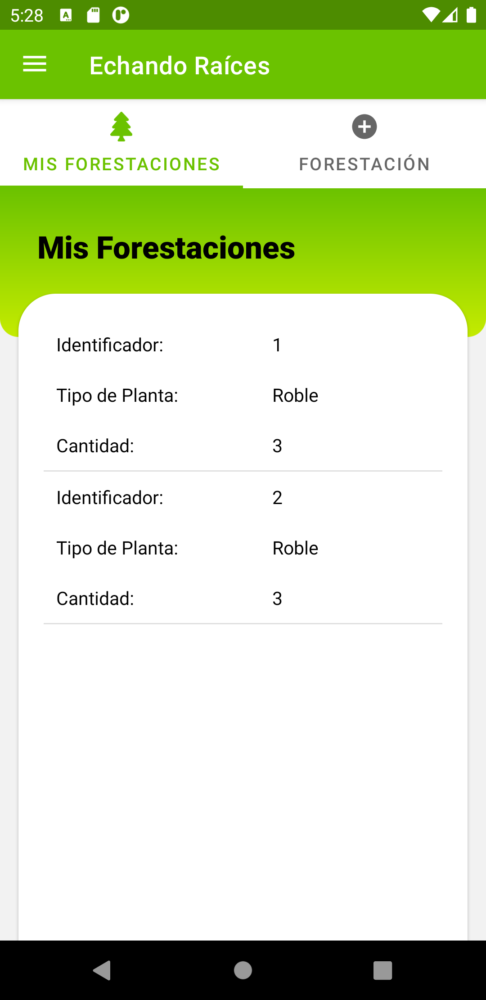
	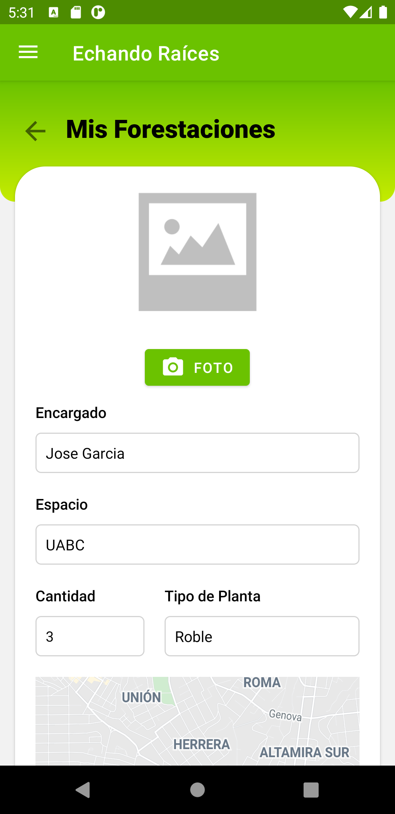

### Agregar Forestación
Aquí se agregan las forestaciones a realizar, solo se llenan los campos _espacio, cantidad, tipo de planta_ y se selecciona la ubicación de esta forestación en el mapa. Después se hace tap sobre el botón verde _AGREGAR FORESTACIÓN_ para guardar.

	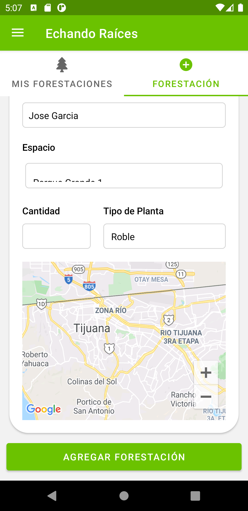

### Acerca de
Aquí se muestran datos de la aplicación, nombre de la fundación y el personal involucrado en el desarrollo de la aplicación.

	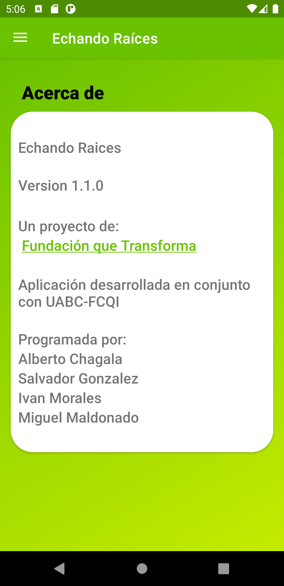

### Cerrar sesión
Esta es la opción para cerrar la sesión del usuario.

	

